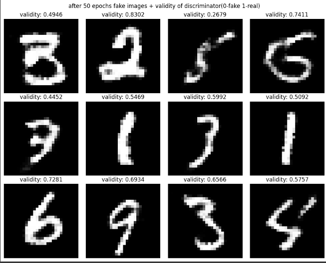
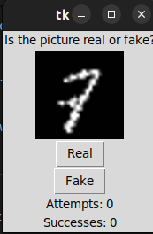

# Gan For Mnist
- I created a GAN framework for the Mnist data set in this repository.
- I create it using Pytorch
- For the generator, I used the Conv transpose layers
- For the Discriminator, I used a pretty simple Convolutional net.
- I Trained multiple times, and, in the end, I saw that the best amount of epochs s.t. the generator is good enough but doesn't collapse is around 50 epochs

- I also created a little game you can play and guess if the images you see are fake or real:
  
- The images are small because if you make them bigger it will just look very blurry
- If you are running it for the first time, It will download the mnist data for you
