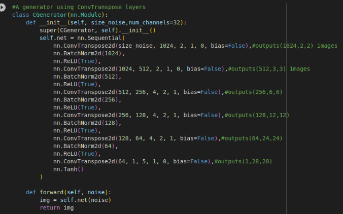

# Gan For Mnist
- I created a GAN framework for the Mnist data set in this repository.
- I create it using Pytorch
- Generator process:
	- For the generator, I first tried to use simple linear layers starting from the noise size and finishing with a size that can be reshaped to 28x28
	- This try did not yield good results, and i went to search for other option.
	- I read [Pytorch tutorial](https://pytorch.org/tutorials/beginner/dcgan_faces_tutorial.html) And saw that they use conv transpose layers, so I decided to use them too. 
	- At first, I wanted simple net, but it wasn't able to create good enough images.
	- So, I decided to use the following structure which worked good: 
	
	- I only needed to test the sizes to see that I get the right shape.
	- The model is still pretty small, Weights only about 20 MB.
- For the Discriminator, I used Convolutional net with 3 conv layers and 3 linear layers: 
- I also fixed a noise vector to see how the generator will progress as the training goes on, and these are the results. I took one image at the start of an epoch and near the end of each epoch: 
	- As we can see, it takes a good 10-12 epochs for the generator to start making something the looks like a number. 
	- That is probably because i used the vanilla SGD optimizer, with 0.003 learning rate, as other optimizers I tried collapsed vary fast. 
I Trained multiple times, and, in the end, I saw that the best amount of epochs s.t. the generator is good enough but doesn't collapse is around 50 epochs


- For comparison, this is what real images look like: 
- I also created a little game you can play and guess if the images you see are fake or real:
  
  
- To run it, just run
```
python3 path/to/game.py
```

- The images are small because if you make them bigger it will just look very blurry
- If you are running it for the first time, It will download the mnist data for you
